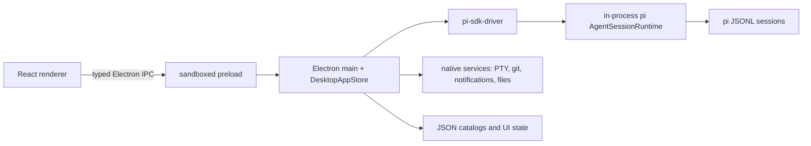
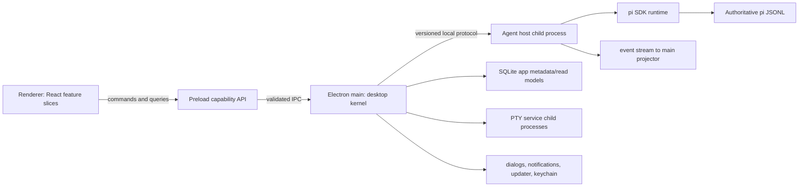

# Pi Desktop Architecture Study

**Status:** Proposed
**Date:** 2026-08-23
**Scope:** Greenfield Electron desktop client for `@earendil-works/pi-coding-agent`

## Executive decision

Build a local-first Electron app with four strict runtime zones:

1. A sandboxed React renderer for presentation only.
2. A small Electron main process for native OS capabilities and window lifecycle.
3. A supervised Node child process (`agent-host`) that owns pi runtimes, extensions, session leases, and agent execution.
4. A SQLite read model for app-owned metadata and fast queries, while pi JSONL files remain the authoritative conversation record.

Do not run pi sessions or third-party pi extensions inside Electron main. Do not copy full transcripts into the app database. Communicate through a versioned, runtime-validated protocol shared by renderer, main, and agent host.

This deliberately differs from pi-gui's in-process main architecture. It costs one additional protocol boundary, but improves crash containment, upgrades, testability, security, and the ability to restart the UI without killing active runs.

## What pi-gui does

The inspected `main` branch (shallow checkout on 2026-08-23) is a pnpm monorepo with:

- `apps/desktop`: Electron 37, React 19, electron-vite, electron-builder, xterm, and node-pty.
- `packages/pi-sdk-driver`: an adapter over `@earendil-works/pi-coding-agent`.
- `packages/session-driver`: app-facing session interfaces and events.
- `packages/catalogs`: JSON-backed workspace, session, and worktree catalogs.
- `apps/website` and `video`: marketing and release assets.

Its runtime topology is:



The important choices are sound:

- The renderer has `contextIsolation: true`, `nodeIntegration: false`, and `sandbox: true`.
- Preload exposes a typed, finite API rather than Node primitives.
- Navigation and external links are controlled by main.
- Pi remains the agent implementation; the GUI adapts it instead of forking it.
- Pi JSONL is the source of truth for transcripts.
- Session leasing guards against multiple owners of one live session.
- Writes are atomic and recoverable from backups.
- Real Electron E2E tests cover core, live-runtime, native, and packaged surfaces.

## Where pi-gui becomes expensive

These are architectural costs, not claims that the project is poorly engineered.

### Electron main is both kernel and application server

Windowing, IPC registration, session execution, catalogs, worktrees, orchestration, PTYs, notifications, and persistence share one process. A pi runtime or extension failure can therefore threaten the desktop shell. A main-process restart also implies an app restart.

### State is centralized and mutation-heavy

The largest inspected hotspots were approximately:

| File | Lines | Concern |
| --- | ---: | --- |
| `electron/app-store.ts` | 3,452 | Broad coordinator and state owner |
| `pi-sdk-driver/session-supervisor.ts` | 2,551 | Runtime, leases, persistence, events, catalogs |
| `electron/app-store-orchestration.ts` | 1,871 | Product workflow coupled to store internals |
| `electron/main.ts` | 1,824 | Window lifecycle plus a large IPC surface |
| `src/App.tsx` | 1,071 | Top-level UI coordination |

Splitting files alone would not solve this. The deeper issue is a command path that mutates a large application snapshot, followed by broad state publication. This encourages incidental coupling and makes multi-window semantics difficult.

### The IPC API is wide and hand-maintained

The preload interface contains many fine-grained methods. TypeScript catches compile-time drift inside the monorepo, but IPC still crosses a trust boundary and needs runtime validation. A large imperative surface is also difficult to version.

### JSON catalogs accumulate migration and query complexity

JSON is ideal for a small beta. As pins, drafts, ordering, orchestration evidence, notification settings, and worktrees accumulate, a versioned monolithic UI-state document requires increasingly defensive parsing and full-document rewrites. It is also awkward for search, filtering, pagination, and transactional invariants.

### Runtime dependencies inflate the desktop package

The desktop manifest directly includes pi plus many transitive provider SDK dependencies and native `node-pty`. Keeping these dependencies in a separately built agent host makes packaged-runtime validation and native rebuilds more explicit.

## Proposed architecture



### Process responsibilities

#### Renderer

- Renders workspaces, sessions, timeline, composer, diffs, terminal, settings, and run status.
- Holds ephemeral view state only: selection, open panels, scroll anchors, optimistic form state.
- Uses query subscriptions and semantic commands such as `session.sendMessage`; it never receives filesystem or process primitives.
- Treats all Markdown, tool output, paths, and extension UI payloads as untrusted.

Organize by feature (`features/session`, `features/workspace`, `features/diff`) rather than by generic component type. Each feature owns its view models, commands, and tests.

#### Preload

- Exposes a small capability API grouped by domain.
- Adds a correlation ID and window ID to commands.
- Performs runtime validation on inputs and outputs using TypeBox (already used by pi) or Zod.
- Offers subscription primitives with explicit unsubscribe and bounded event queues.

Avoid a method for every UI gesture. Prefer roughly 10–15 domain commands plus typed query subscriptions.

#### Electron main: desktop kernel

- Owns BrowserWindows, menus, updater, notifications, deep links, file dialogs, protocol registration, keychain access, and child-process lifecycle.
- Authorizes each IPC request against the sending `webContents`, selected workspace, and allowed path roots.
- Routes commands; it does not own agent business logic.
- Projects agent events into app metadata/read models.
- Can restart agent-host and reconnect windows without losing the UI.

#### Agent host

- Is a bundled Node entry point, launched with a private stdio or local-socket channel.
- Uses pi's SDK (`createAgentSessionRuntime`) initially. Hide that behind our protocol so a future switch to pi RPC/client does not affect Electron or React.
- Owns all live session runtimes, pi extensions, cancellation, message queues, compaction, model selection, and session leases.
- Emits ordered events with `{ protocolVersion, sessionId, runId, sequence, type, payload }`.
- Sends heartbeats and supports graceful drain before app upgrades.
- May survive renderer window closure; whether it survives full app exit remains an explicit product setting.

The SDK is preferable inside this trusted Node host because it exposes complete extension and session APIs. Pi RPC/client is the fallback when stronger binary/version isolation becomes more valuable than SDK completeness.

#### Persistence

Use two stores with explicit ownership:

| Data | Owner | Store |
| --- | --- | --- |
| Messages, tool calls, branches, compaction | pi | Existing JSONL session files |
| Provider auth | pi / OS | Pi auth storage; secrets in OS credential storage where supported |
| Workspace registration, display names | app | SQLite |
| Session UI metadata: pin, archive view, unread, last-opened | app | SQLite |
| Worktree identity and lifecycle state | app | SQLite, reconciled with Git |
| Drafts and window layout | app | SQLite |
| Search text | app projection | SQLite FTS, rebuildable from JSONL |
| Live run state | agent host | Memory plus event checkpoints; never presented as durable truth |

SQLite is a disposable index around durable sources. Every projection must be rebuildable from JSONL and Git. Store schema migrations are transactional and forward-only.

### Protocol design

Use one shared package, `packages/protocol`, containing only schemas and generated TypeScript types. No Electron, React, or pi imports.

Commands use request/response semantics:

```ts
type CommandEnvelope<TType extends string, TPayload> = {
  protocolVersion: 1;
  requestId: string;
  windowId: string;
  type: TType;
  payload: TPayload;
};
```

Events are ordered per session and replayable from a bounded in-memory buffer:

```ts
type SessionEvent<TType extends string, TPayload> = {
  protocolVersion: 1;
  sessionId: string;
  runId?: string;
  sequence: number;
  occurredAt: string;
  type: TType;
  payload: TPayload;
};
```

On a sequence gap, the renderer requests a fresh session projection. This is simpler and safer than attempting unlimited event replay.

### Security model

- Preserve Electron sandboxing, context isolation, disabled Node integration, denied popup creation, and controlled navigation.
- Register a restrictive Content Security Policy; avoid `unsafe-eval` in production.
- Validate IPC at runtime and reject messages from unknown or destroyed `webContents`.
- Pass opaque workspace/session IDs across IPC; resolve and canonicalize paths in main.
- Check canonical paths remain inside the authorized workspace before every read, diff, stage, attachment, or reveal operation. Defend against symlinks and traversal.
- Never expose `shell`, arbitrary command execution, environment variables, or unrestricted file reads to renderer code.
- Run third-party pi extensions only in agent-host. Treat their UI payloads as data, not HTML or JavaScript.
- Redact secrets from logs and crash reports. Store API keys outside SQLite and UI-state files.
- Sign and notarize macOS builds, sign Windows builds, publish checksums, generate an SBOM, and verify updater signatures.

The agent itself necessarily has powerful workspace and shell access. Process isolation reduces accidental app compromise; it is not a security sandbox for a malicious extension. A later hardening phase can place agent-host in an OS sandbox or container with explicit workspace mounts.

## Product choices that can be better

### Make parallel work a first-class run model

Represent `workspace`, `checkout`, `session`, and `run` as separate entities. A worktree is one kind of checkout, not an attribute hidden inside a thread. This supports local sessions, worktrees, remote checkouts, and containers without remodeling the UI.

### Show durable versus live state honestly

The timeline should distinguish persisted transcript entries from transient streaming deltas. On crash recovery, discard incomplete deltas, reload JSONL, and display a clear interrupted-run marker.

### Build recovery into the first milestone

Include agent-host crash/restart, corrupt metadata DB rebuild, stale session lease recovery, missing worktrees, and app update during idle state. These are core desktop behaviors, not polish.

### Treat extensions as a compatibility surface

Map pi extension dialogs, widgets, status, commands, and notifications into a declarative host-UI schema. Unsupported capabilities should render a visible compatibility card. Never let extensions import renderer components.

### Keep orchestration out of the kernel

Multi-agent orchestration should be an optional feature package consuming the same session command/event APIs as the UI. It must not mutate internal app-store structures. This keeps a single-agent MVP small and lets orchestration evolve independently.

### Instrument locally before adding cloud telemetry

Use structured local logs with correlation IDs across renderer → main → agent-host. Add a user-exportable diagnostics bundle that excludes prompts, transcript content, environment variables, and secrets by default.

## Suggested repository layout

```text
apps/
  desktop/
    src/main/          # Electron kernel and IPC authorization
    src/preload/       # capability bridge
    src/renderer/      # React feature slices
  agent-host/          # pi SDK process and protocol server
packages/
  protocol/            # runtime schemas and generated types
  domain/              # IDs, commands, events; no framework imports
  persistence/         # SQLite migrations and repositories
  pi-adapter/          # the only package importing coding-agent
  test-kit/            # fake agent host, fixtures, Electron harness
docs/
  architecture/
```

Dependency direction is one-way: apps depend on packages; `domain` and `protocol` depend on nothing app-specific; only `pi-adapter` imports pi.

## Delivery sequence

### Milestone 1: walking skeleton

- Package Electron with a sandboxed renderer and a minimal typed preload.
- Start agent-host, negotiate protocol version, heartbeat, and shut it down cleanly.
- Add one workspace and create/open one pi session.
- Stream a prompt response and recover the authoritative timeline from JSONL after restart.
- Ship a packaged smoke test, not only a Vite development test.

Exit criterion: a signed-development build can complete one real agent turn, restart, and show the same transcript.

### Milestone 2: daily coding loop

- Session list, model/thinking selection, steering/follow-up queue, cancellation, compaction, attachments, and session branching.
- Git status/diff plus an integrated terminal.
- Worktree-backed checkouts with explicit create/remove recovery.
- Draft, pin, unread, and window-state persistence.

Exit criterion: the app can replace pi's interactive TUI for one local project without transcript divergence.

### Milestone 3: trust and distribution

- Provider onboarding, project trust UI, extension compatibility UI, updater, signing/notarization, diagnostics export, SBOM, and release channels.
- Crash injection tests for renderer, main, agent-host, PTY, corrupted SQLite, stale locks, and interrupted worktree creation.

Exit criterion: beta releases update safely and recover from injected failures without losing a completed transcript entry.

### Milestone 4: differentiation

- Global full-text search and saved filters.
- Run/checkpoint visualization and side-by-side branch comparison.
- Optional multi-agent orchestration implemented above public domain APIs.
- Remote/container agent hosts using the same versioned protocol.

## Testing strategy

- **Protocol contract tests:** every command/event schema, incompatible version rejection, malformed payload rejection.
- **Pi adapter integration tests:** real temporary pi sessions and JSONL fixtures across the oldest and newest supported pi versions.
- **Process tests:** host crash, heartbeat timeout, reconnect, duplicate command ID, cancellation race, event sequence gap.
- **Persistence tests:** forward migrations, transaction rollback, rebuild from JSONL, Git reconciliation.
- **Renderer tests:** reducers/view models with recorded event streams; avoid mocking Electron in component tests.
- **Electron E2E:** real packaged app for workspace selection, one live turn, attachment, terminal, diff, restart recovery, and external-link policy.
- **Release tests:** install, update, downgrade refusal, signature verification, native module loading, and clean uninstall on each supported OS.

Maintain three lanes similar to pi-gui: deterministic core, live pi runtime, and native/packaged. The critical improvement is making agent-host process-failure tests a separate mandatory lane.

## Decisions to make before implementation

1. Initial OS support. Recommendation: macOS Apple Silicon first, then Windows x64/arm64, then Linux; avoid promising all three in the walking skeleton.
2. Agent lifetime. Recommendation: runs survive closing the last window but stop on explicit app quit, with a confirmation when active.
3. Pi version policy. Recommendation: pin one exact version in releases, support importing JSONL from newer versions read-only, and test upgrades explicitly.
4. Database library. Recommendation: Node's stable built-in SQLite API if supported by the chosen Electron Node runtime; otherwise `better-sqlite3`, isolated behind `packages/persistence`.
5. Auto-update channel. Recommendation: stable and beta channels with signed manifests; never update agent-host independently of the desktop protocol in v1.

## Sources

- [pi-gui repository and architecture](https://github.com/minghinmatthewlam/pi-gui)
- [pi coding-agent package](https://github.com/earendil-works/pi/tree/main/packages/coding-agent)
- [pi RPC protocol](https://github.com/earendil-works/pi/blob/main/packages/coding-agent/docs/rpc.md)
- [pi client package](https://github.com/earendil-works/pi/tree/main/packages/client)
